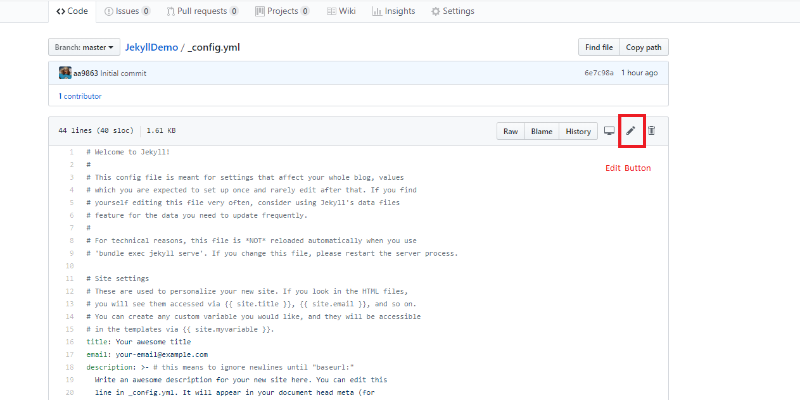

# Using the template

In this article we will go through the process of setting up a new
version of the repository, and make our first change to the content.

You will need to sign up for a [GitHub](https://github.com) account.
Its free, (as free as any other "free" online service is anyway)

## Getting a copy of the template

Our first step is to get a copy of the template.

For this we need to create a new repository. This will create a new
project on github, for your blog.  As we are going to use GitHubs
nifty template feature, this is a pretty simple process.

Visit <https://github.com/djgoldsmith/JekyllTemplate>
Click the "Use this Template" button, and give your blog a name.


!!! info Repository Names

	The repository name you choose will be part of the address for the blog.
	
	For example. A repo with the name MyBlog will be available at
	
	```https://<yourname>.github.io/MyBlog```

!!! note Personal Blogs

	GitHub also allows us to have ONE "user" site. 
	This will have the address ```http://<yourname>/github.io```
	Changing the repository name to <yourname>.github.io will activate this.
	
	We can also have pages for Organisations, so if you have a group of related projects,
	there is no excuse not to have documentation.

	

### Enabling the Pages Feature

We also need to enable the Pages Feature, to make the blog available.

Under Settings, there should be a section on Github pages.
In this case we can set the source to be the **master** branch


### Letting GitHub do its magic

Once pages are enabled, GiHub will scan the repository, workout you
have a Jekyll blog then create and render the content.  The site
should now be available.

!!! note Render Time

	It can take a bit of time for pages to update. 
	Usually its pretty fast though.  If you are not seeing you changes 
	wait a while then refresh the page.

## Making our First Change
	
If you view the page you will notice it has no style of formatting.
This is because the site needs configuring to have the correct
addresses for the Jekyll formatting.

We will need to edit the ```_config.yaml``` file to provide this information.

First we need to get the correct address for the config.  This is
based on the URL (in the address bar) of the site.


For example, if we have the Repository **JekyllDemo** we get.

 - URL (from browser): 
   - ```https://djgoldsmith.github.io/JekyllDemo/```
 - url  
    - ```https://djgoldsmith.github.io/```
 - baseurl 
    - ```/JekyllDemo/```


### Editing config.yaml

To edit the file we need to open it in the web browser then click the edit button.
Change update these lines with the site information

```yaml
baseurl: "/JekyllDemo" # the subpath of your site, e.g. /blog
url: "https://djgoldsmith.github.io" # the base hostname & protocol for your site, e.g. http://example.com
```



We can also update the other site options here.  For example the site name and
your various contact information.

```yaml
title: IOC Blogging Demo
email: my-Email
description: >- # this means to ignore newlines until "baseurl:"
  This is a demo of creating blogs with Jekyll and Github pages.
  We are using it in the Institute Of Coding July Webinars Series.
baseurl: "/JekyllDemo" # the subpath of your site, e.g. /blog
url: "https://djgoldsmith.github.io/" # the base hostname & protocol for your site, e.g. http://example.com
twitter_username: born2briled
github_username:  djgoldsmith
```


### Committing our changes

Finally we need to **commit** our changes.  This will save them along
with a commit message that can remind us (or anyone we are working with) what the change was about


